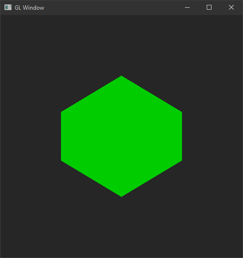

# What is GL Window ?

**GL Window** a.k.a **GLWND** is a GL wrapper libraryto  helps you quickly creating an Modern Open GL application that based on GLFW & GLEW library.

## Information

- [x] Windows 32-bit & 64-bit
- [x] MS Visual Studio
	- [x] for 32-bit application
	- [x] for 64-bit application

## Feature
* Modern Open GL
* Automatic using highest Open GL version that supported by graphic driver
* Interactive
  * Keyboard Events
  * Mouse Events
  * Drag & Drop Events
* Etc


## License

Released under the [MIT](LICENSE.md) license

## Requirement

* MS Visual C++ 2012 or later
* GLEW & GLFW third party installed

## Installation

* MS Visual C++ Configuration
  * Include `$(SolutionDir)glwnd\include`
  * Library `$(SolutionDir)glwnd\lib\$(Platform)\$(Configuration)`

* Usage
	* Take a look at the [example\example.cpp](example\example.cpp)

## Demo

```cpp
#include <gl/glew.h>

#include <glwnd.h>
#pragma comment(lib, "glwnd.lib")

class GLWindowExample : public GLWindow
{
public:
  GLWindowExample() : GLWindow() {};
  virtual ~GLWindowExample() {};

  virtual void on_display()
  {
    glColor3f(0.0, 1.0, 0.0);
    glBegin(GL_POLYGON);
    {
      glVertex3f(0.F, 0.5F, 0.F);
      glVertex3f(-0.5F, 0.2F, 0.F);
      glVertex3f(-0.5F, -0.2F, 0.F);
      glVertex3f(0.F, -0.5F, 0.F);
      glVertex3f(0.F, 0.5F, 0.F);
      glVertex3f(0.5F, 0.2F, 0.F);
      glVertex3f(0.5F, -0.2F, 0.F);
      glVertex3f(0.F, -0.5F, 0.F);
    }
    glEnd();
  }
};

int APIENTRY wWinMain(HINSTANCE hInstance, HINSTANCE hPrevInstance, LPWSTR lpCmdLine, int nCmdShow)
{
  GLWindowExample win;
  win.run();

  return EXIT_SUCCESS;
}
```



## Contact
Feel free to contact via [Twitter](https://twitter.com/vic4key) / [Gmail](mailto:vic4key@gmail.com) / [Blog](https://blog.vic.onl/) / [Website](https://vic.onl/)